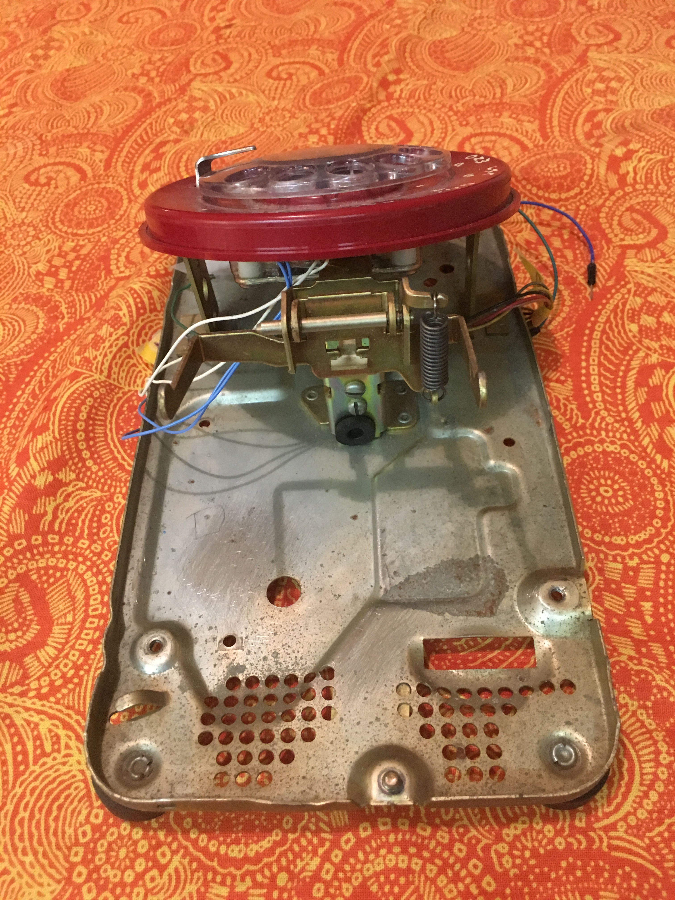
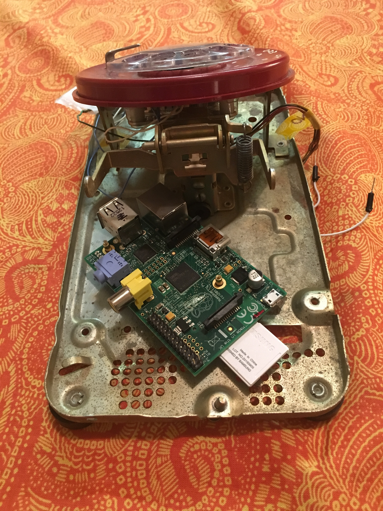

# TelephoneJukebox

<!---
# Overview

I obtained a 1985 Western Electric rotary phone from eBay and mounted a Raspberry Pi in it.  The phone is now configured so that dialing a year will play a random mp3 from the top music charts from that year.  The dialed year and the name of the song are displayed on an LCD screen that is mounted in the top of the phone.  To play a specific song, you can dial the year and the chart position.  (For example "198301" gets you the number one hit from 1983)

# Hardware

Without Raspberry Pi           |  With Raspberry Pi Mounted
:-----------------------------:|:------------------------------:
  |  
--->
